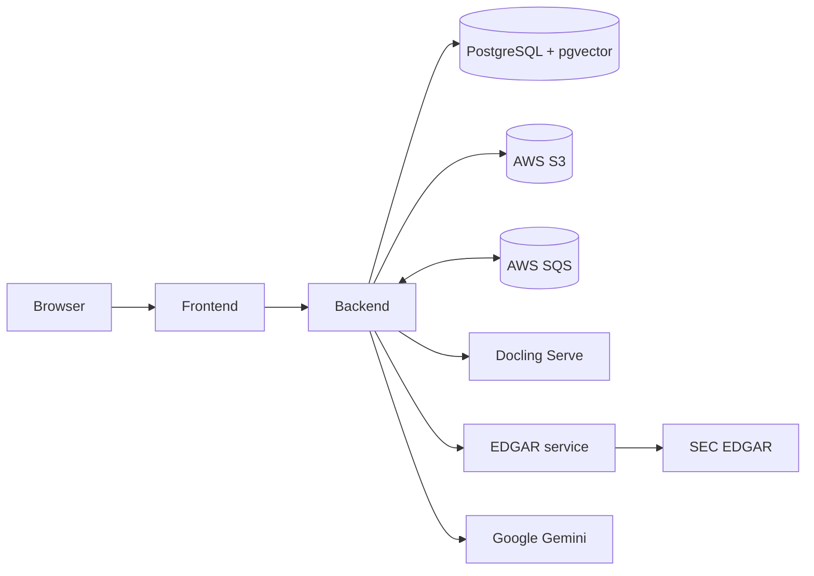

# FinDoc Analyzer

FinDoc Analyzer is a self-hosted workspace for importing SEC filings and uploaded documents, indexing their contents, and answering questions with filing-aware citations. Data and retrieval are isolated by team, while a system administrator manages teams and users.

## What it does

- Imports `10-K`, `10-K/A`, `10-Q`, and `10-Q/A` filings from SEC EDGAR.
- Uploads PDF, text, Markdown, and DOCX documents through presigned S3 URLs.
- Parses uploads with Docling and SEC filings with the Python EDGAR sidecar.
- Stores 384-dimensional MiniLM embeddings in PostgreSQL with pgvector.
- Uses progressive retrieval, Gemini generation, and numbered source cards to ground chat answers.
- Tracks amendment relationships and prevents superseded filing sections from polluting retrieval.
- Processes analysis work asynchronously through SQS, with a PostgreSQL outbox for application-originated jobs.
- Supports `SUPER_ADMIN`, `ADMIN`, and `MEMBER` roles with team-scoped document access.

## Repository components

| Component     | Purpose                                                                        |          Default port | Documentation                                      |
| ------------- | ------------------------------------------------------------------------------ | --------------------: | -------------------------------------------------- |
| Frontend      | Next.js UI for onboarding, administration, the vault, EDGAR import, and chat   |                `3000` | [frontend/README.md](frontend/README.md)           |
| Backend       | Spring Boot API, identity, ingestion orchestration, retrieval, and persistence |                `8080` | [backend/README.md](backend/README.md)             |
| EDGAR service | FastAPI adapter around `edgartools`                                            |                `8100` | [edgar-service/README.md](edgar-service/README.md) |
| Eval harness  | Local ingestion, retrieval, generation, and judge evaluations                  |                   n/a | [evals/README.md](evals/README.md)                 |
| PostgreSQL    | Metadata, outbox records, and pgvector embeddings                              | `5432` in development | —                                                  |
| Docling Serve | PDF and text conversion for uploaded documents                                 | `5001` in development | —                                                  |



## Prerequisites

For the containerized stack:

- Docker with Compose
- An AWS S3 bucket and SQS queue configured to deliver S3 object-created events to that queue
- AWS credentials that can read and write the bucket and consume and publish to the queue
- A Google Gemini API key
- An SEC-compliant EDGAR identity containing an application name and contact address

For source development, also install Java 21, Node.js 24 with pnpm 11, Python 3.13, and [uv](https://docs.astral.sh/uv/).

## Run the full stack

1. Create the shared environment file:

   ```bash
   cp .env.example .env
   ```

2. Set the required values in `.env`:

   ```dotenv
   AWS_ACCESS_KEY_ID=...
   AWS_SECRET_ACCESS_KEY=...
   AWS_REGION=...
   AWS_SQS_QUEUE_NAME=...
   AWS_S3_BUCKET_NAME=...
   JWT_SECRET=...
   GEMINI_API_KEY=...
   EDGAR_IDENTITY=findoc-analyzer you@example.com
   POSTGRES_USER=...
   POSTGRES_PASSWORD=...
   POSTGRES_DB=...
   ```

3. Build and start the production stack:

   ```bash
   make prod
   ```

4. Open [http://localhost:3000](http://localhost:3000). On a new database, the login screen redirects to one-time super-admin onboarding. Create a team and team users before using the vault.

The production overlay exposes only the frontend. Frontend `/api/*` requests are routed to the backend inside the Compose network.

Stop the stack with `make prod-down`. `make prod-clean` also deletes the PostgreSQL volume and is destructive.

## Local development

Start PostgreSQL, Docling, and the EDGAR sidecar:

```bash
cp .env.example .env
make dev
```

Before starting the backend from source, create `backend/.env` with the same application credentials and local dependency URLs. If it does not already exist, `cp .env backend/.env` is sufficient.

Then start the application services in separate terminals:

```bash
cd backend
./mvnw spring-boot:run
```

```bash
cd frontend
corepack enable
pnpm install --frozen-lockfile
pnpm dev
```

The backend loads `backend/.env` when run from that directory. The Compose commands load the root `.env`.

Useful lifecycle commands:

| Command                                             | Result                                                                   |
| --------------------------------------------------- | ------------------------------------------------------------------------ |
| `make dev`                                          | Start only local infrastructure dependencies                             |
| `make dev-build [backend\|edgar-service\|frontend]` | Build all development images or one selected image                       |
| `make dev-down`                                     | Stop development dependencies                                            |
| `make dev-clean`                                    | Stop dependencies and delete PostgreSQL data                             |
| `make prod` / `make prod-down`                      | Start or stop the full production stack                                  |
| `make demo` / `make demo-down`                      | Start or stop the full stack with demo quotas and the frontend demo hint |
| `make help`                                         | Show all development and evaluation targets                              |

Demo mode enforces limits of 15 documents, 10 users, 3 teams, and 5 MB per upload. It displays `demo` / `password` as a login hint but does not seed that account; provision it before publishing a demo.

## Testing

Run each component from its own directory:

```bash
cd backend && ./mvnw verify
cd edgar-service && uv run pytest
cd frontend && pnpm lint && pnpm format:check && pnpm build
cd evals && uv run pytest
```

Backend integration tests use Testcontainers and require Docker. Networked SEC tests, the real Docling test, evaluation tests, Gemini generation, and model-based judging are opt-in; see the component READMEs for their exact commands.

## Deployment

Pushing a Git tag runs `.github/workflows/deploy.yml`, which publishes separate backend, frontend, and EDGAR service images to GitHub Container Registry. The published frontend image is compiled with the Compose backend destination and demo login hint; use different build arguments for another topology or a non-demo image.
